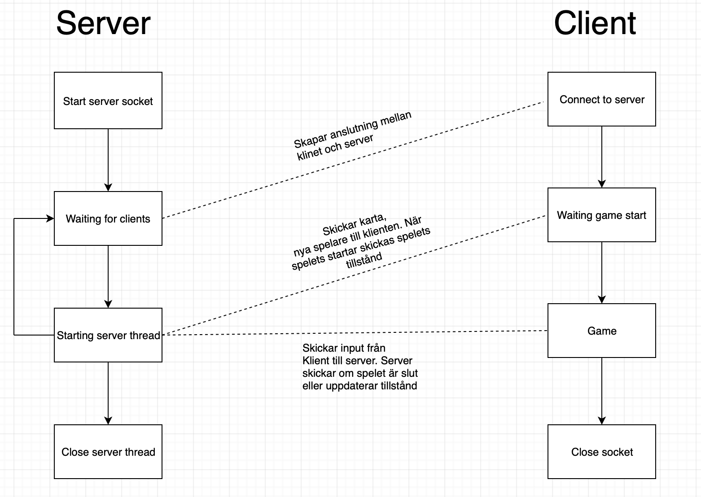

# Det rougeliknande spelet `AngerMan`
Spelet är ett Rougeliknande spel. Två eller fler spelare startar på en randomiserad plats på en karta. Lika många vapen som spelare slumpas ut på kartan.
Spelet går ut på att plocka upp ett vapen, och sedan gå in i en motspelare. Är motspelaren vapenlös förgörs motspelaren, annars sker en duell. Vid en duell förlorar båda spelarna sina vapen, och nya vapen randomiseras ut på kartan.
Kaartan innehåller väggar som spelare ej kan gå in i. Två spelare kan ej befinna sig samtidigt på samma ruta. Spelarna kan bara ta upp varsitt vapen.

* All information skickas som strängar i UTF-8 format.

# Set up grafic
Efter att ha anslutit till server-socketen sätts spelet spelet upp.

### Kartan
* Servern skickar antingen strängen `SendingMap`. I sådana fall är nästa meddelande själva kartan.
Första strängen är dimensionen på kartan på formen "kolumn,rad" (obs, inget space) där "kolumn" är antalet kolumner och "rad" antalet rader.  
Andra strängen är själva kartan, en sträng bestående av 1:or och 0:or. 1:a symboliserar en vägg, 0:a ett tomt utrymme. Strängen innehåller ingen radbrytning, utan Clienten får själv införa en ny rad efter så många tecken som "col" anger.

### Nya spelare
* Eller så skickas en sträng som meddelar om nya spelare anslutit, t.ex. `player1 Connected`

### StartGame
* Efter att kartan skickats skickas ett `StartGame` vilket indikerar att spelet börjar.

# Game
När strängen `StartGame` tagits emot skickas en sträng med information om alla objekts positioner och tillstånd. Första delen av strängen innehåller position och tillstånd för spelarna. Andra delen innehåller positioner för vapen.

### Spelar-positioner
Första delen av strängen kommer på formen "kolumn,rad,tillstånd" (inget space). Formen upprepar sig för antalet spelare. "Kolumn,rad" Är alltså spelaren position i x, y-led. "Tillstånd" är ifall spelaren har ett vapen eller ej, där 0 betyder vapenlös, 1 betyder att spelaren har ett vapen.
Strängen `56,3,0,23,78,1` indikerar alltså att spelplanen har två spelare på position 56,3 samt 23,78 där den första inte har ett vapen.

### Vapen-positioner
Andra delen av strängen är vapnens position på formen "kolumn,rad". Formen upprepar sig på samma sätt som ovan utifrån hur många vapen som finns utlagda på spelplanen. Finns inga vapen utlagda utgår denna del av strängen.

### Förflyttning
För att förflytta klientens spelare ett steg till vänster, skicka strängen `left` till servern.
För att förflytta klientens spelare ett steg till höger, skicka strängen `right` till servern.
För att förflytta klientens spelare ett steg upp, skicka strängen `up` till servern.
För att förflytta klientens spelare ett steg ner, skicka strängen `down` till servern.
Efter att en förfrågan om förflyttning skickats skickar servern en sträng med nya positioner och tillstånd för spelare och vapen, se rubrikerna "Spelar-positioner" samt "Vapen-positioner"

# Vinnare
Ifall servern har hittat en vinnare, skickas dennes nummer tillbaka som en sträng. T.ex. ifall player1 har vunnit, skickas `1` tillbaka som en sträng. Detta är enda gången längden på en skickad sträng är 1, dvs indikationen på att spelet är över är att den sträng som skickas från servern har längden 1.

# Avsluta
Avsluta genom att `escape` till servern.

# State diagram

